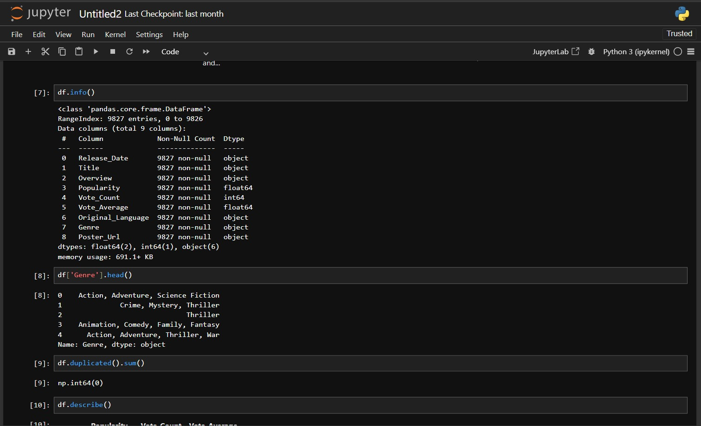

# 🎬 Netflix Movies & TV Shows Data Analysis

## 📌 Project Overview

This project focuses on **Exploratory Data Analysis (EDA)** of the Netflix Movies & TV Shows dataset using Python and Jupyter Notebook.

The goal is to explore the dataset, identify patterns and trends, and generate meaningful insights through data analysis and visualization.

## 🛠️ Tools & Technologies

- Python
- Jupyter Notebook
- Pandas
- NumPy
- Matplotlib
- Seaborn

## 🔍 Analysis Performed

- Dataset overview and data understanding
- Missing value analysis
- Data cleaning and preprocessing
- Movies vs TV Shows analysis
- Content rating analysis
- Country-wise content analysis
- Genre analysis
- Release year trends
- Data visualization
- Insight generation

## 📊 Analysis Screenshots

### 1. Analysis

### 2. Analysis

### 3. Analysis

## 📓 Jupyter Notebook

The complete Python-based analysis is available in:

**Netflix_Movie_Analysis.ipynb**

It contains the complete process of data cleaning, EDA, visualization, and insights.

## 💡 Key Learning

Through this project, I practiced using Python for:

**Data Cleaning → Exploratory Data Analysis → Data Visualization → Insight Generation**

## 👨‍💻 Author

**Pawan Rathore**  
Aspiring Data Analyst  
Python | SQL | Excel | Power BI
